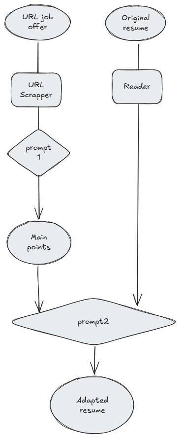

# **Job-Thrust**

Avaiable at: [Job-Thrust](10.103.0.28:7860)

Pitch link: [Pitch](https://youtu.be/QKZND7Nk8YE)

If would want to run it locally, you can do it by clonig te repo and running the following command:

```bash
pip install -r requirements.txt
python app.py
```

## **Description**

Job-Thrust is a platform designed to simplify the process of job applications by enabling job seekers to effortlessly tailor their résumés to specific job offers. Built using **Gradio** for the user interface and OpenAI's **GPT-4** for AI-driven résumé adaptation, this tool bridges a critical gap in the job application process.

---

## **Pain Point**

Today, job seekers often face the tedious task of manually adjusting their résumés to fit different job offers. This process is time-consuming and frustrating, particularly when struggling to pass the initial ATS (Applicant Tracking System) filters. Many resort to mass-applying to jobs, which is suboptimal for both job seekers and employers:

- **Job Seekers:** Limited chances of success due to generic résumés.
- **Employers:** Difficulty identifying the best candidates from non-tailored applications.

Some existing AI-based solutions attempt to assist in résumé creation but fall short when it comes to **adapting résumés to specific job offers**. Current platforms have notable limitations:

### **Existing Solutions**

1. **[Resume.io](https://resume.io/):**
   - Helps fill templates with generalized questions.
   - Recommends jobs based on résumés but lacks features for tailoring résumés to specific job offers.

2. **[Enhance CV](https://enhancv.com/ai-resume-builder/):**
   - Offers conversational assistance to build résumés.
   - Can import data from LinkedIn but does not adapt résumés for specific job offers.

3. **[Career.io](https://career.io/):**
   - Simple résumé builder with LinkedIn integration.
   - Focused on template creation without adaptation features.

### **Market Gap**

There is a clear need for a tool that helps job seekers:

1. Adapt their résumés to specific job offers.
2. Improve their chances of passing ATS filters and advancing in the hiring process.
3. Present tailored résumés that allow employers to identify ideal candidates more quickly.

---

## **Solution**

Job-Thrust solves this problem with the following architecture:



### **How It Works**
1. **Step 1: Job Offer Analysis**
   - The first prompt extracts key information from the job offer, ensuring the résumé focuses on the most relevant details.

2. **Step 2: Résumé Adaptation**
   - A second fine-tuned prompt ensures the résumé retains its main strengths while highlighting details aligned with the job offer.

### **Key Features**
- **Inputs:** 
  - A URL to the job offer.
  - The original résumé (PDF format).
- **Output:** 
  - A tailored résumé adapted to the job offer.
  
This approach ensures ease of use and allows job seekers to apply for multiple positions quickly and effectively, increasing their chances of success.

---

## **Impact**

Job-Thrust was tested by three individuals: two job seekers and one HR professional. Here’s their feedback:

### **Enrico Gazola** (HR Professional, [ASF - Além da Segunda Fase](https://www.alemdasegundafase.com.br/))

*"So, here’s the deal: the résumé definitely got better in a lot of ways. First off, no grammar mistakes like in the original, which is already a win. Second, it really customized the résumé for the job. It aligned the objectives with what the position needed and even managed to adapt skills from unrelated experiences. Like, there was some gastronomic experience, and it turned that into 'strong communication and interaction skills,' making it fit the job description, even though the areas were completely different.*

*That said, there are some things that it totally made up. For example, in the technical skills section, it added stuff that wasn’t in the original résumé at all. I didn’t mention any of those skills, not even once. I think it 'hallucinated' because it saw those skills listed as job requirements and just added them. So yeah, while it’s impressive how it adapted the résumé, it does throw in some details that aren’t accurate."*

### **Mariana Porfírio** (Job Seeker)

*"I think the adaptation was too minor; not much changed in the résumé. I liked the changes in the Objective section since they didn’t deviate too far from my original and felt more appealing to the job offer. I also appreciated the addition of a new Habilities (Skills) section, as my résumé really lacked one."*

### **Anderson Benjamin** (Job Seeker)

*"I really liked how the résumé aligned with the presented job position. The descriptions of the experiences I've been through are clear, objective, and well-structured, making total sense in relation to the position's requirements. I found the content to be straight to the point and very well adapted to what is being requested."*

---

## **Conclusion**

Job-Thrust addresses a gap in the job application process by combining advanced AI with an easy-to-use platform. It empowers job seekers to present tailored résumés, enhancing their chances of landing jobs and helping employers identify the most suitable candidates.

---

## Future Work

- **Improving Accuracy:** Enhance the AI model to avoid adding inaccurate details to the résumé.
- **User Interface:** Develop a more user-friendly interface to guide users through the résumé adaptation process.
- **Integration:** Implement a feature to directly apply to job offers from the platform.

---

This project is aimed at A:

- **Problem:** Simplifying the process of job applications by enabling job seekers to effortlessly tailor their résumés to specific job offers. Happy if feedback is positive
- **Uniqueness:** Adapts to many types of job offers, as long as there is affinity between the résumé and the job offer. Is not a jack-of-all-trades solutions like others services, but achieves better results for your application.
- **Impact:** Tested with potential users and judged by an HR proefessional.
- **Tools:** This tools doesn't relies on information providede by LLM, but rather relies on accurate prompts and tool to extract and adapt information from job offers and résumés.
- **Research:** Examples of existing solutions and their limitations.
